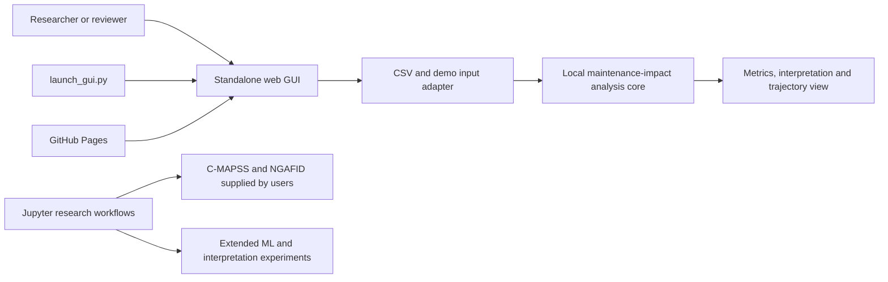

# MII-CODE software architecture and interfaces

## Software type

MII-CODE is **standalone software**. The user interface runs either from the public GitHub Pages URL or from the packaged standard-library launcher. It does not require a host platform, plug-in manager, remote API or server-side data service.

## Architecture



## Components

| Component | Location | Responsibility |
| --- | --- | --- |
| Standalone launcher | `launch_gui.py` | Serves the packaged GUI on the local loopback interface and opens a browser. |
| Graphical user interface | `docs/index.html` and `docs/assets/app.mjs` | Collects input, manages local files, renders results and supports responsive/keyboard use. |
| Analysis core | `docs/assets/analysis.mjs` | Parses delimited files, detects numeric columns, constructs windows and calculates effect metrics. |
| Research notebooks | `notebooks/` | Perform the extended C-MAPSS and NGAFID scientific workflows. |
| Reviewable Python exports | `src/` | Expose notebook code cells for inspection and syntax validation. |

## User interface

- Public GUI: https://pimlphm.github.io/xims-maintenance-impact-code/
- Offline/local GUI: `python launch_gui.py`
- No user file is uploaded by the browser GUI.
- The public interface accepts CSV files up to 5 MB and at most 200,000 non-empty rows.

## CSV input interface

The first row must contain column names. At least one column must be predominantly numeric. The user selects the signal column, maintenance index, window size and health direction. Empty and non-numeric values in the selected signal are excluded before analysis.

## JavaScript analysis interface

`docs/assets/analysis.mjs` exports:

- `parseDelimited(text)` — parse comma-, semicolon- or tab-delimited text;
- `numericColumns(headers, rows)` — discover columns suitable for analysis;
- `extractSeries(rows, column)` — create the numeric signal;
- `analyseSeries(values, eventIndex, windowSize, higherIsHealthier)` — return window statistics, relative change, Cohen's d and interpretation;
- `createDemo()` — generate a deterministic built-in demonstration.

## Standalone launcher interface

```text
python launch_gui.py [--host HOST] [--port PORT] [--no-browser] [--root DIRECTORY]
```

The default bind address is `127.0.0.1`. Exposing the launcher on another address is an explicit operator choice and does not add authentication or transport encryption.

## Trust boundary

The lightweight GUI provides an exploratory local comparison. It does not execute the full trained research models, certify maintenance effectiveness or replace engineering review. Raw datasets, model weights and credentials are outside the standalone package boundary.
